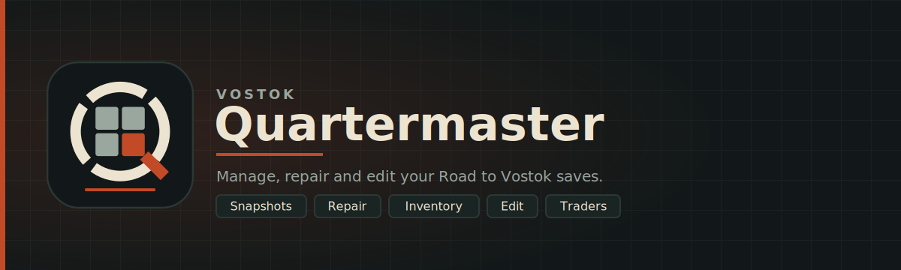

<p align="center">
  
</p>

# Vostok Quartermaster

Back up, repair, inspect and edit your **Road to Vostok** saves. A lightweight Windows app: only about **6 MB**, portable, nothing to install.

> **Unofficial tool. Not affiliated with the Road to Vostok Ltd.**
> Keep your own copy of `%AppData%\Road to Vostok\` the first time you try any save tool.

## Why "Quartermaster"?

A quartermaster is the person who keeps track of the camp's stores: what you have, where it is kept, and what needs fixing before the next trip out. You spend half of Road to Vostok hauling crates and counting ammo, so this app plays quartermaster for your save. It keeps your stockpile in view, backs it up, and repairs it when something goes missing. (Also, "Save Manager" sounded boring. XD)


## Features

- **Snapshots:** back up your whole save folder with an optional tag, restore any snapshot, and see the day, time, season, difficulty, weather and an Ironman badge for each one. Restoring first backs up your current save automatically.
- **Auto backup (off by default):** creates a snapshot a few seconds after the game saves. The newest 20 automatic snapshots are kept; manual ones are never removed. A skip list leaves cache folders out of snapshots.
- **Repair:** finds items that come from mods which are no longer installed (the usual reason a save stops loading after a game update) and writes a cleaned copy as a new snapshot. Anything stored inside a removed item, such as a furniture locker, goes with it.
- **Inventory:** a read-only view of what your character wears and carries and what is stored in each shelter, with the game's own item icons.
- **Edit:** change character meters (health, energy, hydration, temperature, mental, reputation, stamina, cat health), conditions, cat found, and world values (day, time, difficulty, weather). The result is written to a new snapshot.
- **Traders:** completed and in-progress tasks per trader, with the portrait from the game and an estimated trade tax.
- **Settings:** save folder, game folder (found automatically in the default Steam location), backups folder, skip list, auto backup.

A **Mods** tab is planned and shows as "Soon" in the sidebar.

## Install (players)

1. Download the latest build from [Releases](https://github.com/PR0Gorib/VostokQuartermaster/releases): either the **portable `.exe`** (nothing to install) or the **installer**.
2. Run it. It finds your save folder (`%AppData%\Road to Vostok\`) on its own.
3. For item icons and for Repair, it needs your game folder (the one containing `RTV.pck` and `mods`). If the game is not in the default Steam location (`C:\Program Files (x86)\Steam\steamapps\common\Road to Vostok`), choose it in **Settings → Game folder**.

Requirements: Windows 10 or 11 with Microsoft WebView2 (included with current Windows).

Where things are kept:

| What | Where |
|---|---|
| Game saves | `%AppData%\Road to Vostok\` |
| Quartermaster snapshots | `%AppData%\com.pr0gorib.vostokquartermaster\backups\` (Settings → Backups folder → Show in Explorer) |

Item icons and trader portraits are read from your own game files when needed. They are never copied into the app, its backups or this repository.

## How it works

- **Saves are Godot `.tres` text resources.** `src/tres.js` reads them as their original lines and only replaces single lines or removes whole blocks, so a file you did not change round-trips byte for byte (spacing, number formats, line endings).
- **Repair** lists each `ext_resource` that points into `res://mods/<name>/`, compares the names with the folders in the game's `mods` folder, and for every missing mod removes the item slots that use it, anything nested or stored inside those slots, and the now unused `ext_resource`. A validator then checks that no reference is left dangling.
- **Edit** only replaces the value on a property's own line. Values are clamped and formatted the way the game writes them.
- **Icons** come from the game's `RTV.pck`. `src/pck.js` reads the pack's file table (Godot 4, pack format 3) without loading the multi-gigabyte file, finds an item's `Icon_*.png.import` next to its definition, and decodes the S3TC (DXT1/3/5) texture it names to a PNG in memory.
- **Trade tax** is an estimate from observed values: base tax x (1 - tasks done / 10). It matched the in-game values seen so far (Generalist, Doctor, Gunsmith). The game's real formula is not documented.


## Build your own

### Prerequisites

Before building from source, make sure you have:

- [Node.js](https://nodejs.org/) (LTS recommended)
- [Rust](https://rustup.rs/) (stable toolchain)
- Microsoft C++ Build Tools ("Desktop development with C++") and WebView2, as described in the [Tauri v2 prerequisites](https://v2.tauri.app/start/prerequisites/)

### Setup

```bash
git clone https://github.com/PR0Gorib/VostokQuartermaster.git
cd VostokQuartermaster
npm install
npm run tauri dev       # run in development
```

### Build a release

```bash
npm run tauri build
```

The built installer/binary will be under `src-tauri/target/release/`.


## Notes for developers

- Tauri v2 with `withGlobalTauri: true`, so plugin APIs are on `window.__TAURI__` and no imports are needed. Plugins: `fs` (with the `watch` feature), `dialog`, `opener`, `window-state` and `persisted-scope`.
- Register `tauri_plugin_persisted_scope::init()` **last** in `lib.rs`. It remembers the folders a user picked, so the game folder stays readable after a restart.
- `capabilities/default.json` grants `core:default`, `opener:default`, `dialog:default`, `window-state:default` and these file permissions: `fs:allow-read-file`, `fs:allow-read-text-file`, `fs:allow-write-file`, `fs:allow-write-text-file`, `fs:allow-read-dir`, `fs:allow-copy-file`, `fs:allow-mkdir`, `fs:allow-remove`, `fs:allow-rename`, `fs:allow-exists`, `fs:allow-stat`, `fs:allow-watch`, `fs:allow-unwatch`, plus `fs:allow-open`, `fs:allow-read`, `fs:allow-seek` and `fs:allow-fstat` (needed to read `RTV.pck` without loading it).
- **CSP is strict:** no inline scripts and no inline `style="..."` attributes (use classes); images from `data:` URLs are allowed for the icons.
- The file scope allows `$DATA/Road to Vostok/**` and `$APPDATA/**`, and the default Steam game folder. Any other game folder is added at runtime when the user picks it in the dialog.
- Do not change the bundle identifier (`com.pr0gorib.vostokquartermaster`) once users have it: it decides where settings and backups are stored.


## Project structure

```
VostokQuartermaster/
├── package.json              # scripts: tauri
├── src/                      # the whole frontend: plain HTML, CSS and JS, no bundler
│   ├── index.html            # sidebar, #view, toast, <dialog>; loads tres.js, pck.js, app.js
│   ├── styles.css
│   ├── tres.js               # lossless .tres reader/editor (window.Tres, also module.exports)
│   ├── pck.js                # Godot .pck reader + S3TC icon decoder (window.Pck, also module.exports)
│   └── app.js                # the app: one IIFE, pages, snapshots, repair, edit
└── src-tauri/
    ├── Cargo.toml
    ├── tauri.conf.json       # window, bundle, CSP
    ├── capabilities/default.json   # permissions and file access scope
    ├── icons/
    └── src/lib.rs, main.rs   # plugin registration only, no custom commands
```

## Limitations

- Item icons exist only for the base game; modded items show a category glyph.
- Trader tax is an estimate (see above). Driver and Hunter will be added once their tasks and values are confirmed.
- The inventory is read-only for now. Inventory editing and quest editing are planned.
- Tested on Road to Vostok Build 2 (v0.2.0.5). A game update can change the save format.

## Contributing and bug reports

Issues and pull requests are welcome. For a bug report please include your game version, what you did, and what you expected. Do not attach save files or game assets you do not want to share.

## Credits

Quartermaster follows the ideas of two earlier community tools. Both are MIT licensed; their code was not copied, the code here is written from scratch.

- [VostokVault](https://github.com/jonigirl/vostok-vault) by jonigirl: backup, restore and save repair.
- [RTV Save Editor](https://github.com/FINDarkside/Road-to-Vostok-Save-Editor) by FINDarkside: save viewing and editing.

Built with [Tauri](https://tauri.app/). *Road to Vostok* and its art belong to their respective owners.

## License

This project is licensed under the MIT License - see the [LICENSE](LICENSE) file for details. This applies to the code in this repository only, not to *Road to Vostok* or any of its assets.
